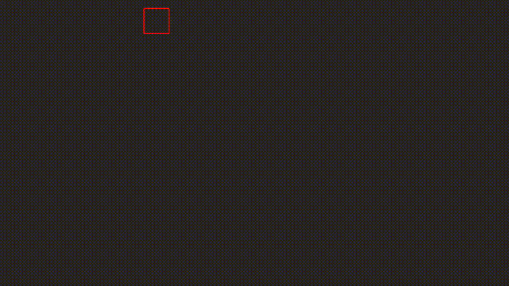

# Maze Generator and Solver

This project implements a visual maze generator and solver using Python and the Tkinter library. The application creates a random maze and solves it step-by-step with animations, showcasing recursive algorithms for maze generation and pathfinding.



## Features

1. Maze Generation:
  * Generates a random maze using a recursive backtracking algorithm.
  * Walls between cells are dynamically "broken" to create the maze.
  * Entrance and exit points are automatically created.
2. Maze Solver:
  * Uses depth-first search (DFS) to find a path from the start to the finish.
  * Animates the solution process in real-time.
3. Visualization:
  * Built-in visualization of maze generation and solving.
  * Color-coded cells and movements

## Installation

- Clone the repository:

```git clone https://github.com/marcosgama/maze_solver.git``

- Navigate to the project directory and run the program:

  ```python maze.py```

## How It Works

- Maze Generator:
  * Starts with a grid of cells, each surrounded by walls.
  * Visits cells recursively, breaking walls between adjacent cells to form a maze.
  * Ensures every cell is reachable, creating a perfect maze (no loops, single solution).

- Maze Solver:
  * Traverses the maze using a DFS approach.
  * Visually displays the pathfinding process, including backtracking when a dead-end is reached.
  * Stops when the solution path is found.

## Controls

- Close the application window to terminate the program.

## Dependencies

- Python 3.x: Make sure you have Python installed.
- Tkinter: Pre-installed with most Python distributions.
